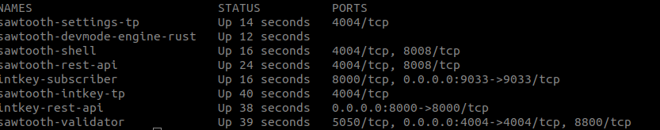
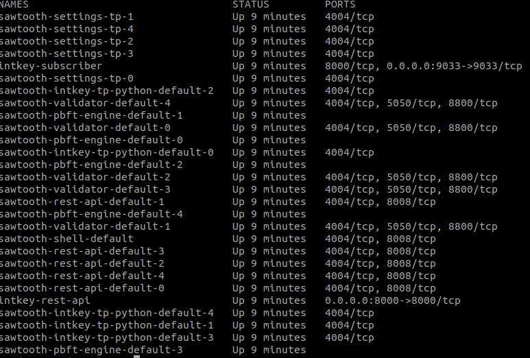
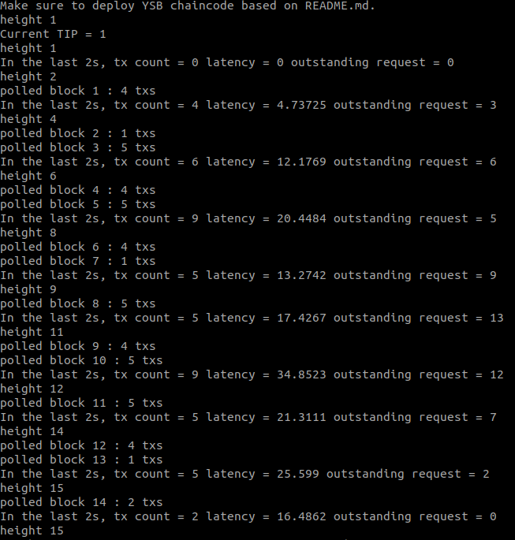

<a name="top"></a>

# Manual for using KVSTORE with hyperledger Sawtooth as a backend

## Overview

This document provides a walk through running the BLOCKBENCH adapted KVSOTRE workload for hyperledger Sawtooth blockchain. 
This steps where tested using the following infrastructure:

 A laptop with 8GB of RAM and 8CPUs running ubuntu 18.04

## Prerequisites
This application development environment requires the latest version of Docker Engine and Docker Compose.


<details><summary>Setting up hyperledger Sawtooth 1.2.4 network </summary>


1. Clone blockbench repository

```
git clone https://github.com/wejdeneHaouari/blockbench
```
2. You can launch sawtooth network using either DEVMODE or PBFT

    2.1. Lauch hyperleger Sawtooth using DEVMODE 
```
cd /blockbench/benchmark/sawtooth_v1_2
docker-compose -f docker-compose-devmode.yaml create
docker-compose -f docker-compose-devmode.yaml build
docker-compose -f docker-compose-devmode.yaml up

```
   2.2 Make sure you have this containers running:

```
docker ps 
```


 2.3. Or Lauch hyperleger Sawtooth using PBFT
```
cd /blockbench/benchmark/sawtooth_v1_2
docker-compose -f docker-compose-pbft.yaml create
docker-compose -f docker-compose-pbft.yaml build
docker-compose -f docker-compose-pbft.yaml up
```

   2.2 Make sure you have this containers running:

```
docker ps 
```

</p>
</details>
 


<details><summary>KVSTORE workload setup</summary>
1. Install dependencies:

```
sudo apt-get install build-essential2sudo apt-get
install libtool3sudo apt-get install autoconf4sudo
apt-get install libcurl4-gnutls-dev
```

2. Install restclient-cpp dependencies

```
git clone https://github.com/mrtazz/restclient-cpp.git
cd restclient-cpp/ && ./autogen.sh && ./configure && sudo make install
cd ..
```

3.  install BLOCKBENCH kvstore executable
```
cd blockbench/src/macro/kvstore/
make
```

4.  Prepare the endpoint `endpoint=[block-service-address],[txn-service-address1],[txn-service-address2]....` based on the configuration of the container intkey-subscribe (block-service-address) and intkey-rest-api (txn-service-address) in the docker-compose file that you used to run Hyperledger Sawtooth. 

For the default configuration and assume helper services are run in the same machine as the client driver use this endpoint configuration: 
```
 endpoint=localhost:9033,localhost:8000
```

 5. Launch the client driver processes. Each client thread will randomly contact one of the transaction web service to invoke a transaction or make a query. Usage example:
```
 ./driver -db sawtooth-v1.2 -threads 1 -P workloads/workloada.spec -txrate 5 -endpoint ${endpoint} -wl ycsb -wt 20 2>&1 | tee output.txt
```

The output of this command should be similar to this:


Note: In order to change the number of total send requests change `recordcount` variable in `workload\workloada.spec` file.

6. (Optional) You can transform the output of the workload after you redirect it to a file using this script: `python3 parse_output.py inputFile outputFile`

Usage example:
```
## make sure you are still under blockbench/src/macro/kvstore ##
python3 parse_output.py output.txt result.csv
```

</p>
</details>

<details><summary>Clean up</summary>
1. Shut the network

```
cd blockbench/benchmark/sawtooth_v1_2
```

1.1 If you have used DEVMODE consenus

 
```
docker-compose -f docker-compose-devmode.yaml down
```  
1.2 If you have used PBFT consenus

 
```
docker-compose -f docker-compose-pbft.yaml down
``` 
</p>
</details>

<sup>[_back to top_](#top)</sup>
